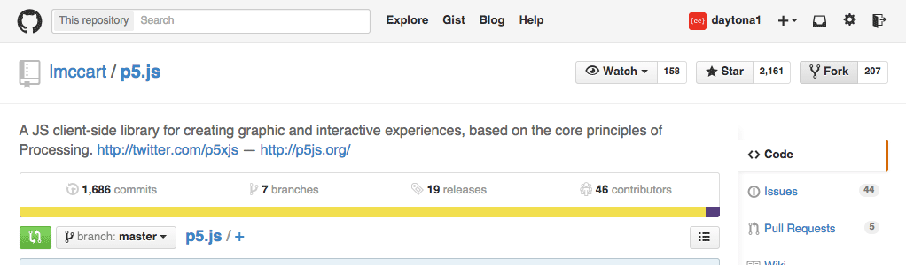
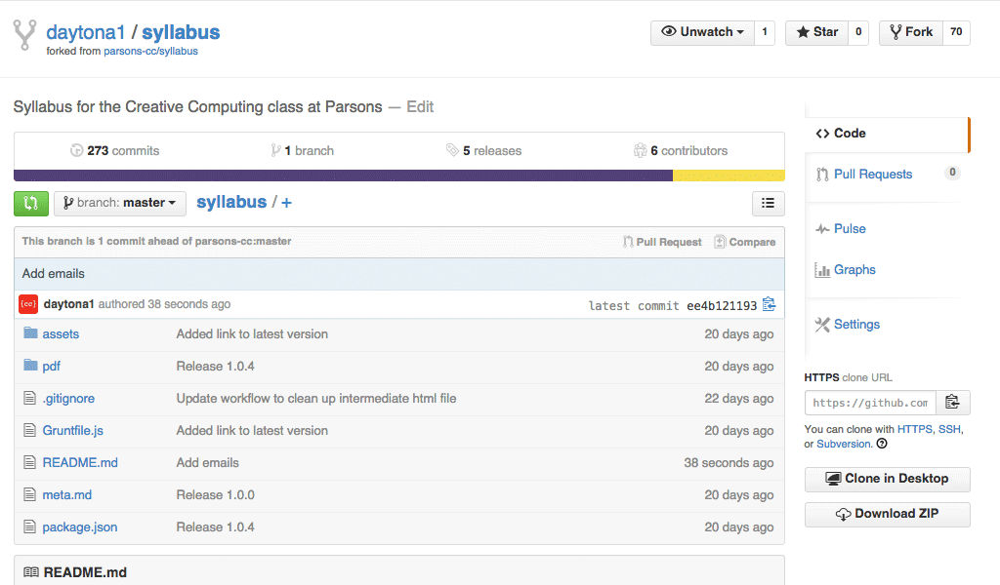

## Terms

Theses are some common terms that will be helpful in understanding how we're using _GitHub_ in class:

 * ***[Git](http://en.wikipedia.org/wiki/Git_%28software%29)*** is a ["revision control system"](http://en.wikipedia.org/wiki/Revision_control) built for programming projects. Think of it as a "Save" for your code project, in the same way you would save an Adobe Illustrator file or a Word document. Or even better, think of it as [Time Machine](http://en.wikipedia.org/wiki/Time_Machine_%28OS_X%29) for your code, since it keeps track of all of your changes, and allows you go back to older versions if you need to.

 * ***[GitHub](http://en.wikipedia.org/wiki/GitHub)*** is a website built around _Git_. It's sort like _Git+_ — allowing you to  easily host your code on a server, browse it using a snappy interface, and share and collaborate with others.

 * A ***repository*** is the archive where all the information about your project is stored. Every _Git_ project has a _repository_, and it stores the change history for in all the files in your project (as well as a few other pieces of information about it).

 * A **commit** is basically an individual "save" for a _Git repositry_. It's a snapshot of a particular moment in a project's history, containing information about everything that has changed since the last _commit_. When you save a _commit_ you also add a _commit message_, which is a brief written description of what has changed in the project.

 * ***[Forking](https://help.github.com/articles/fork-a-repo/)*** is basically cloning existing an existing _Git repository_ so that you can add your own changes. It allows for the easy sharing of code, and has two common purposes: **1)** Copying a project so that you can use it as a starting point so you use at as a starting point for your own version, or **2)** Fixing/improving a project on your own in order to submit back to the original one (see _pull request_ below).

 * A ***[pull request](https://help.github.com/articles/using-pull-requests/)*** is a way of submitting changes from your _forked repository_ back to the original git project (see _forking_ usage #2 above). When you are done making changes to your copy of the project, you submit a _pull request_ and the person in charge of the original project has the option to accept the changes or not. _(We are also using this feature in class for submitting homework, which is not quite standard but it's good practice)_.

<em>**Note:** There are several other important terms used in most Git development like ***add***, ***pull***, ***push***, and ***working copy*** — but since we're not using any of these features in class I'll leave it up to you to investigate them if you're curious.</em>

## How Tos

### How to _fork_ a project in GitHub

1. Login to GitHub if you haven't already
2. Go to the project you would like to fork on GitHub (in this case, Lauren McCarthy's [p5.js](https://github.com/lmccart/p5.js)).
3. Click the "Fork" button on the upper-righthand side of the page.
4. **BOOM!** You forked it! Now you should see the project under your username (in the above example, [`daytona1/p5.js`](https://github.com/daytona1/p5.js)), and a link back to the original below it.

### How to submit a _pull request_ in GitHub

When handing in each assignment, you should submit a _pull request_.

1. Login to GitHub if you haven't already
2. Go to **your forked version** of the project you'd like to submit (here I am going to my copy of the syllabus at [`daytona1/syllabus`](https://github.com/daytona1/syllabus), which I forked from the class site at [`parsons-cc/syllabus`](https://github.com/parsons-cc/syllabus)).
3. Look for the green fork button () on the upper left-hand side of the interface. Click it!
4. This will start the process of submitting your changes.
    *  **If you are re-submitting an existing pull request** this will take you to the screen for the pull request and **you can stop here**.
    * **If this is your first time submitting this pull request** then you will be taken to a page to review your changes.
5. Once you have reviewed your changes and you're sure you want to submit, hit the green pull request button once more.
6. You will be brought to a screen where you can write a title and description for the pull request. Give it a meaningful title and add any notes or questions to the descrption. Hit the green button one last time.
7. **BOOM!** You submitted the pull request! You'll notice you're taken to a page for the pull request under the original repository. If submit any further changes to this pull request you this page will we updated with your new changes.
